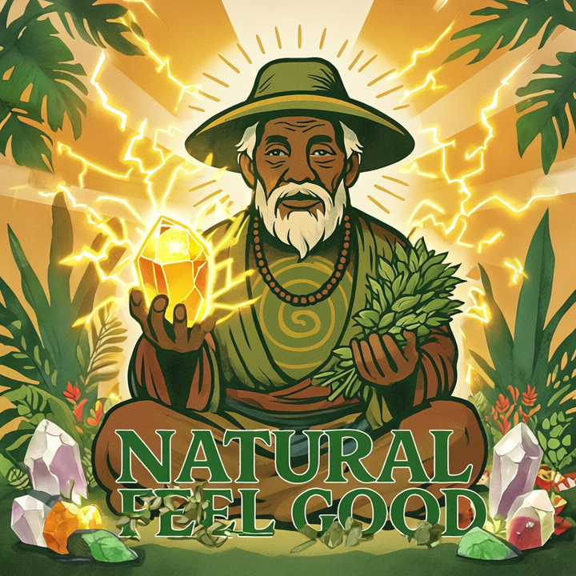

# NaturalFeelGood

  

NaturalFeelGood is a modular .NET 8 web application designed to manage and provide information about natural remedies, alternative treatments, and related entities. The solution follows clean architecture principles, separating domain, application, and infrastructure layers.

## Solution Structure

-  **NaturalFeelGood**: ASP.NET Core Web API project. Entry point for the application.
-  **Domain**: Contains core business entities and value objects (e.g., `RemedyAlternative`, `Medication`).
-  **Application**: Implements business logic, MediatR commands/queries, and interfaces.
-  **Infrastructure**: Handles data persistence (DynamoDB), configuration, and repository implementations.
-  **S3 Integration**: Handles file and object storage using Amazon S3 buckets.

## Main Features

- **Entity Management**: CRUD operations for remedies, element types, and other domain entities.
-  **DynamoDB Integration**: Generic context for flexible access to tables and basic CRUD operations.
-  **S3 Bucket Integration**: Store and retrieve files and assets using Amazon S3.
-  **CQRS Pattern**: MediatR for command and query separation.
-  **Validation**: FluentValidation for input validation.
-  **Object Mapping**: AutoMapper for DTO/entity mapping.
-  **API Documentation**: Swagger (Swashbuckle) for interactive API documentation.

## Getting Started

### Prerequisites

- [.NET 8 SDK](https://dotnet.microsoft.com/download/dotnet/8.0) 
- [Amazon DynamoDB](https://docs.aws.amazon.com/amazondynamodb/latest/developerguide/Introduction.html)  (local or AWS instance)
- [Amazon S3](https://docs.aws.amazon.com/s3/index.html)  (for file/object storage)
---

## License

This project is licensed under the [Apache License, Version 2.0](http://www.apache.org/licenses/LICENSE-2.0).

> **NOTICE:**  
> The name “Natural Feel Good” and the domain “naturalfeelgood.com” are protected by Uiliam Goltz Elesbão as identifiers of the brand and may not be used, reused, or referenced in derivative projects, products, or publications without express written consent.

© 2025 Uiliam Goltz Elesbão. All rights reserved.
